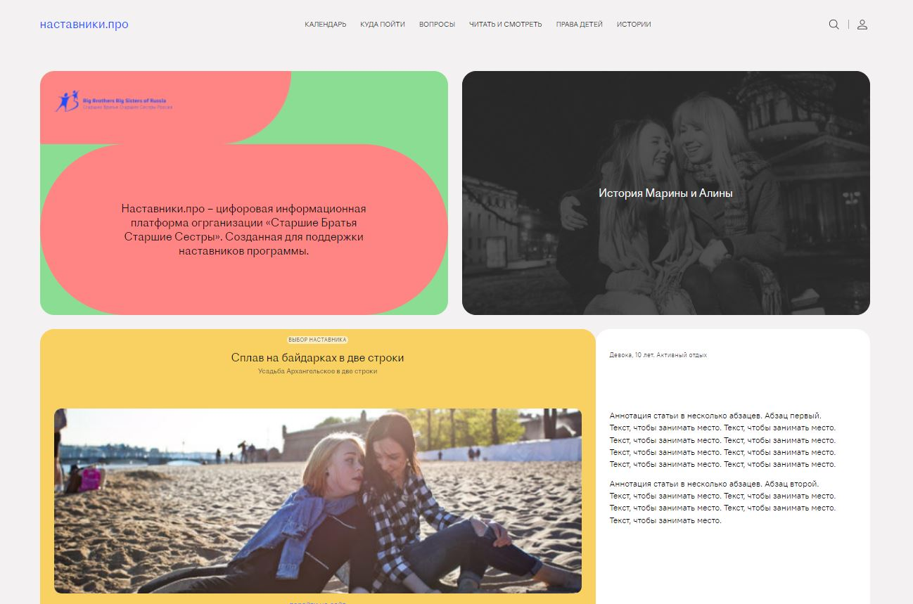
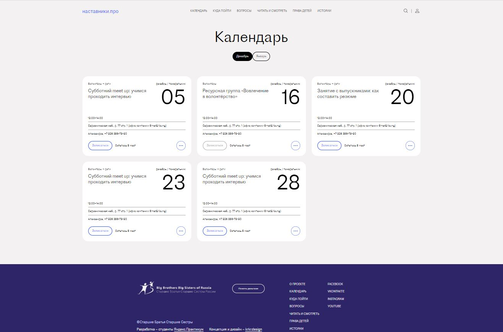
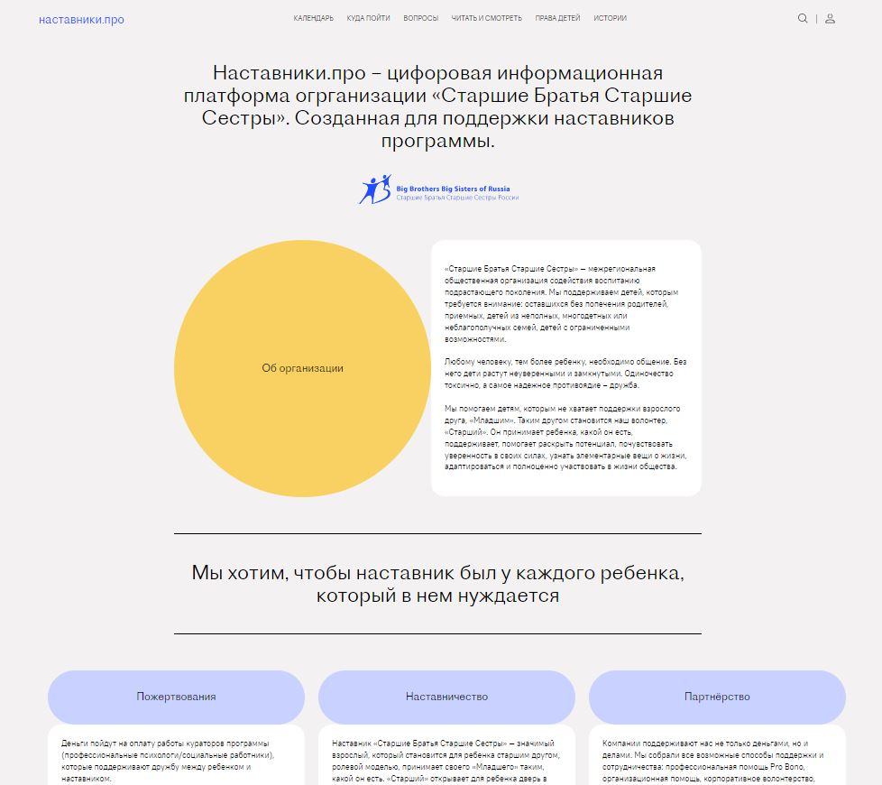

# Сайт для НКО "Старшие Братья Старшие Сёстры"

«Старшие Братья Старшие Сестры» — межрегиональная общественная организация содействия воспитанию подрастающего поколения. НКО поддерживает детей, которым требуется внимание: оставшихся без попечения родителей, приемных, детей из неполных, многодетных или неблагополучных семей, детей с ограниченными возможностями.

# **Цели сайта/приложения**

Сайт станет единой платформой, где наставники смогут делиться своим опытом и быть в курсе предстоящих мероприятий, иметь возможность записаться на них.

- Записаться на мероприятие, проводимое для наставников;
- Поделиться местом посещения с ребёнком;
- Найти ответы на вопросы по общению с ребёнком;
- Изучить доп.материалы для наставников (статьи / видео / фильмы / права детей etc);
- Поделиться историей дружбы.

  

  

  

# **Авторы**
Вёрстка сайта и дальнейшее добавление интерактивности производится студентами веб-факультета Яндекс.Практикума

Вёрстку выполнили:
- Ирина Василькова
- Михаил Киричков
- Владимир Блинов
